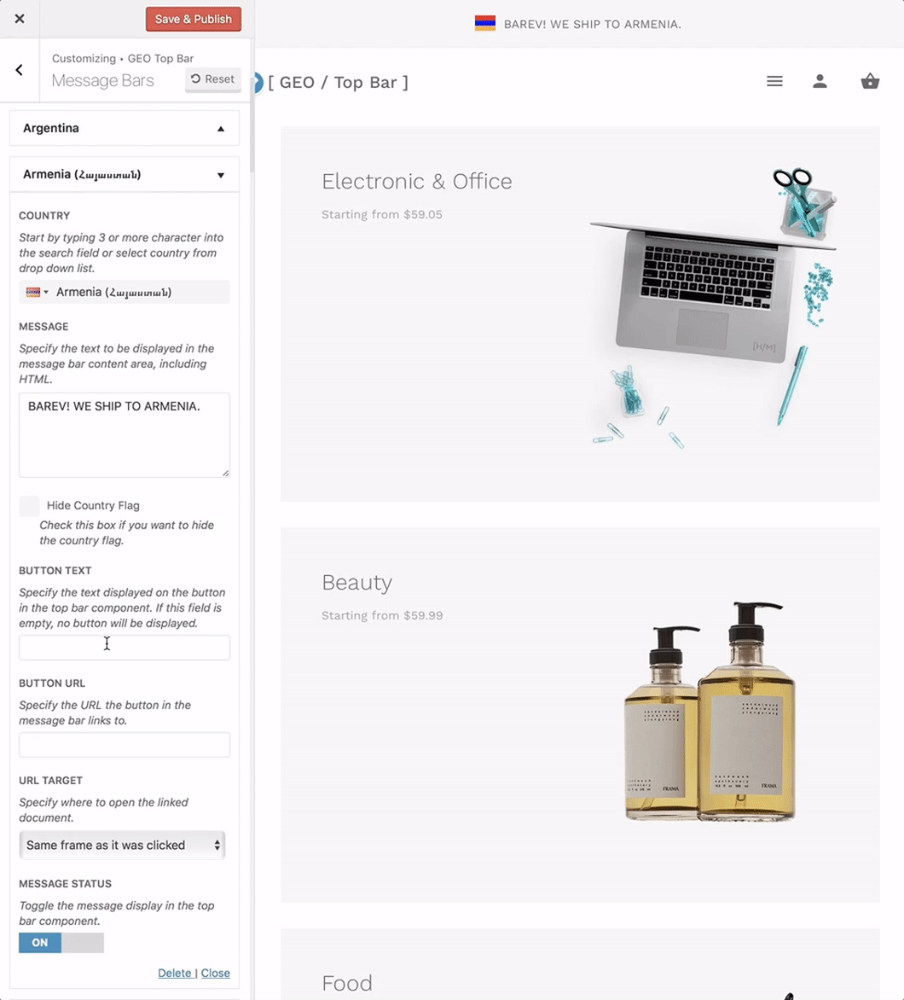

# How to Append a Button to the Message Bar Content?

Specifying any text as button text will display a button in the top bar component. if you leave this field empty, no button will be displayed.

Navigate to **Appearance > Customize > GEO Top Bar > Message Bars** and here you will be able to locate the **"Button Text"** option.



### How to Add a URL to the Button?

Specifying any web address URL creates a link to the button in the top bar component.

Navigate to **Appearance > Customize > GEO Top Bar > Message Bars** and here you will be able to locate the **"Button URL"** option.

### How to Change Button Target Attribute?

The target attribute specifies where to open the linked document.

Navigate to **Appearance > Customize > GEO Top Bar > Message Bars** and here you will be able to locate the **"Button Target"** option.

### Property Values

* ```Same frame as it was clicked``` The **default** value. 
* ```Open in a new window or tab```
