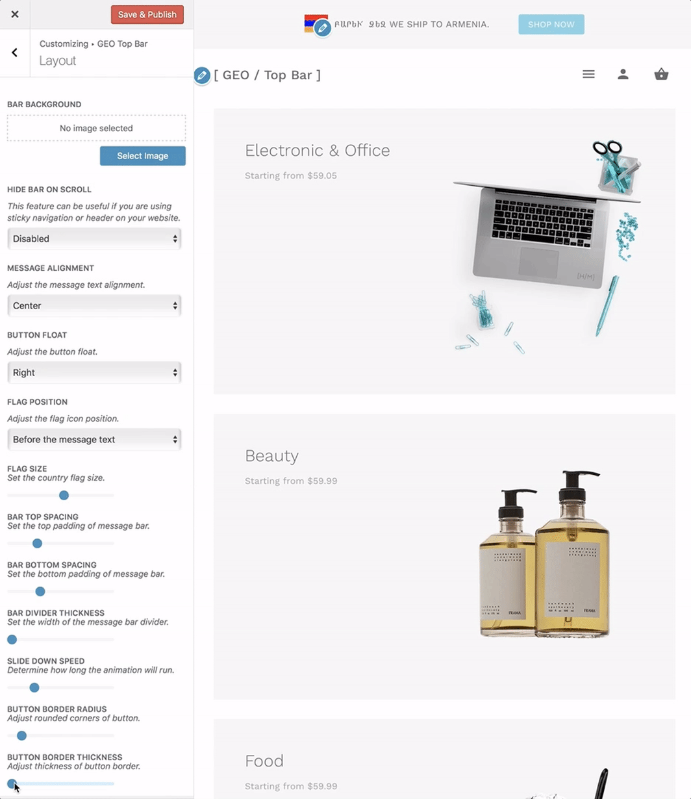

# How to Change Bar Button Border Thickness?

The button border thickness property sets the width of a message bar button border.

?> This border width will be applied to all 4 corners of the button.

Navigate to **Appearance > Customize > GEO Top Bar > Layout** and here you will be able to locate the **"Button Border Thickness"** option.

### Usage

This option offers a basic horizontal range slider that can be moved by dragging the left mouse click to the desired value.
