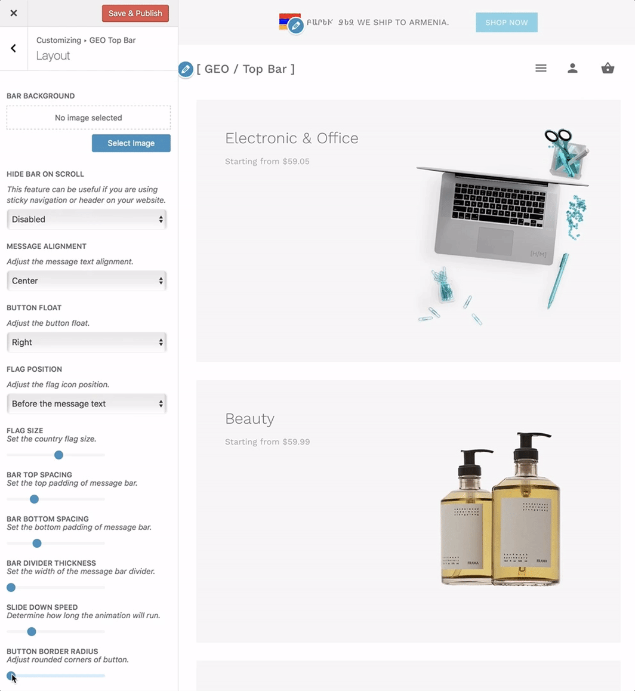

# How to Change Bar Button Radius?

The border-radius property is used to add rounded corners to a message bar button element.

?> This radius will be applied to all 4 corners of the button.

Navigate to **Appearance > Customize > GEO Top Bar > Layout** and here you will be able to locate the **"Button Border Radius"** options.

### Usage

This option offers a basic horizontal range slider that can be moved by dragging the left mouse click to the desired value.
