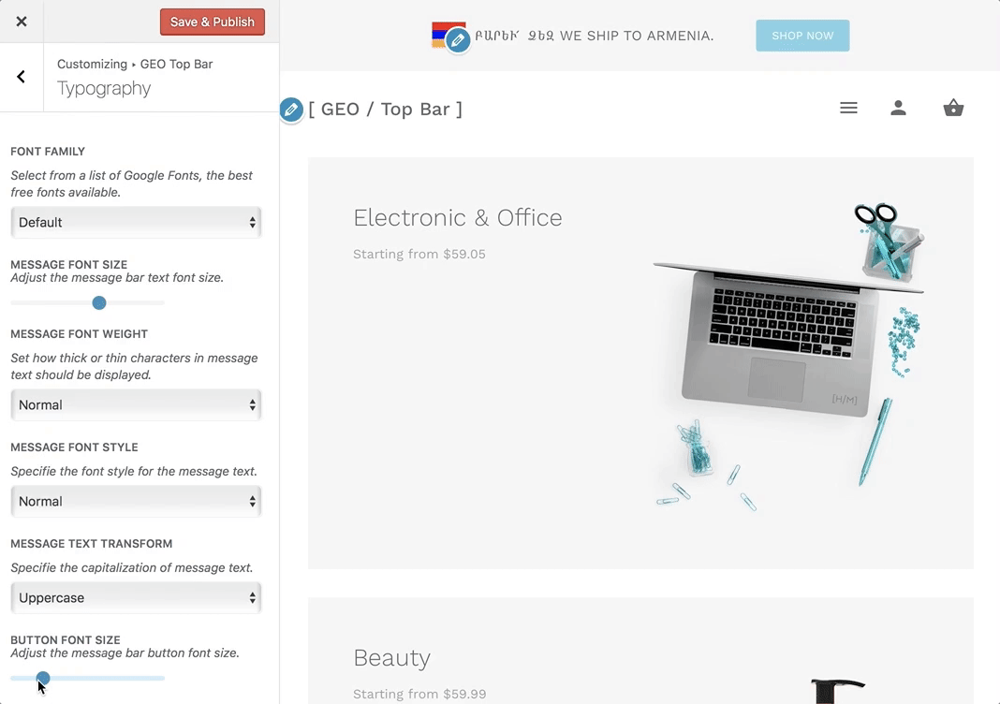

# How to Change Bar Button Font Size?

The font size property specifies the size, or height, of the message bar button font.

Navigate to **Appearance > Customize > GEO Top Bar > Typography** and here you will be able to locate the **"Button Font Size"** options.

### Usage

This option offers a basic horizontal range slider that can be moved by dragging the left mouse click to the desired value.
