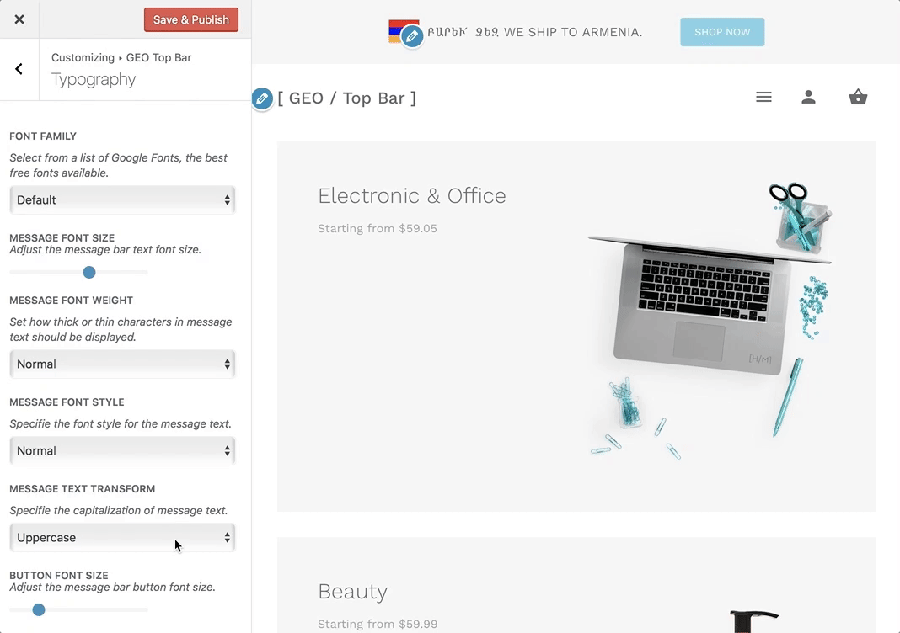

# How to Change Bar Content Text Transform?

The text-transform property controls message bar content text case and capitalization.

Navigate to **Appearance > Customize > GEO Top Bar > Typography** and here you will be able to locate the **"Message Text Transform"** option.



### Property Values

* ```None```:  No capitalization. The text renders as it is.
* ```Capitalize```: Transforms the first character of each word to uppercase.
* ```Uppercase```: The **default** value. Transforms all characters to uppercase.
* ```Lowercase```: Transforms all characters to lowercase.
* ```Initial```: Sets this property to its default value.
* ```Inherit```: Inherits this property from its parent element.

?> Capitalize will capitalize words that appear inside single or double quotes, and the first letter after a hyphen. It won't capitalize the first letter after a number, so dates like "February 4th, 2015" won't transform into "February 4Th, 2015".
