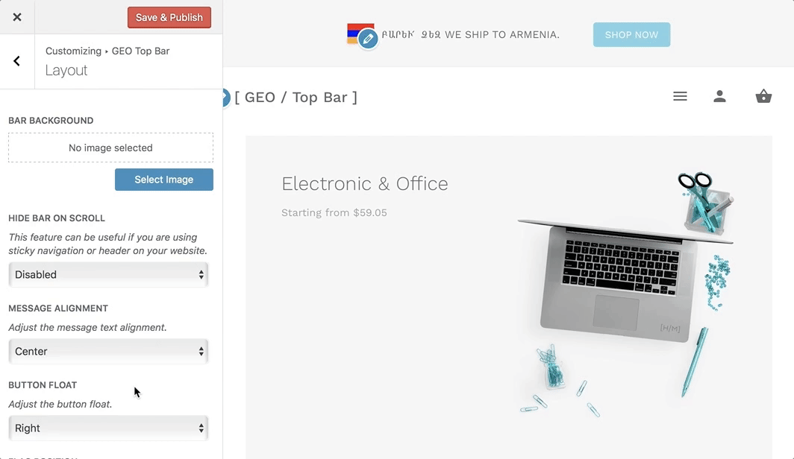

# How to Change Button Float?

The button float property specifies that the button should be placed along the **left or right side** of the message bar content.

Navigate to **Appearance > Customize > GEO Top Bar > Layout** and here you will be able to locate the **"Button Float"** option.



### Property Values

* ```Left```:  Button aligns along the left side of the message bar content.
* ```Right```: The **default** value. Button aligns along the right side of the message bar content.
