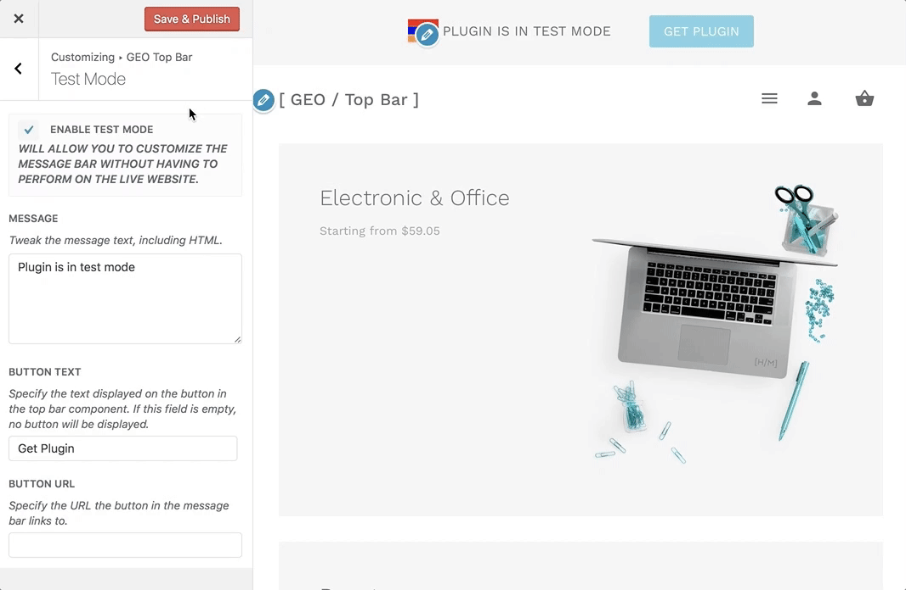

# How to Disable GEO Top Bar Test Mode?

Navigate to **Appearance > Customize > GEO Top Bar > Test Mode** and here you will be able to locate the **"Enable Test Mode"** option.

*Unchecking **Enable Test Mode** checkbox will deactivate test mode.*

### Default Country Modal

!> Note that opening the default country modal window while using the plugin on test mode is not possible.
