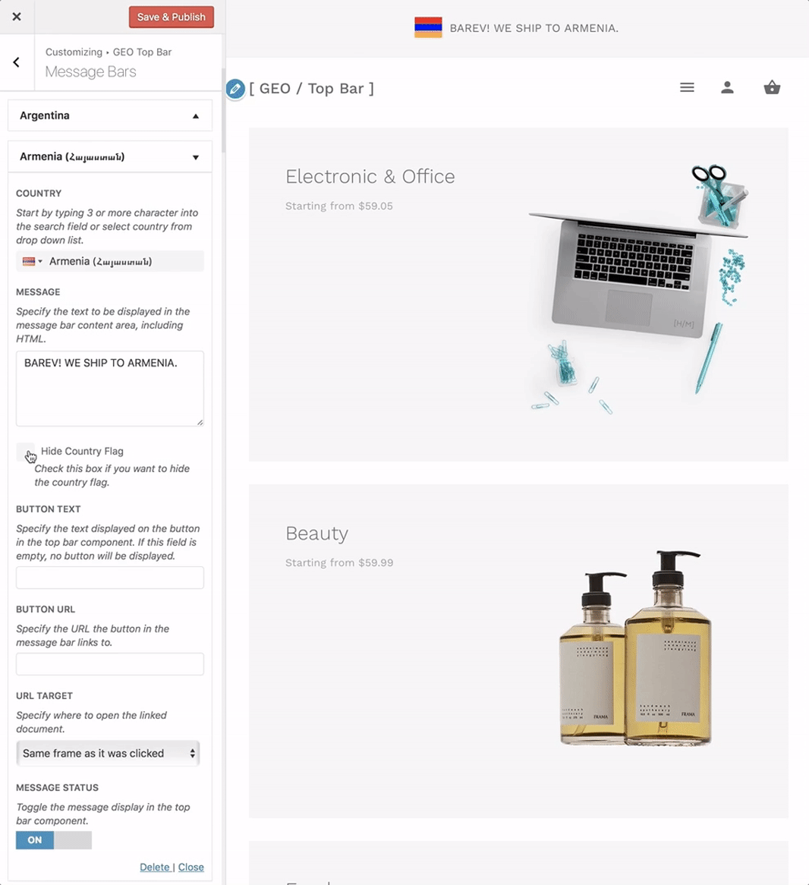

# How to Hide Country Flag?

Checking **Hide Country Flag** checkbox will remove the country flag from the view.

Navigate to **Appearance > Customize > GEO Top Bar > Message Bars** and here you will be able to locate the **"Hide Country Flag"** option.

